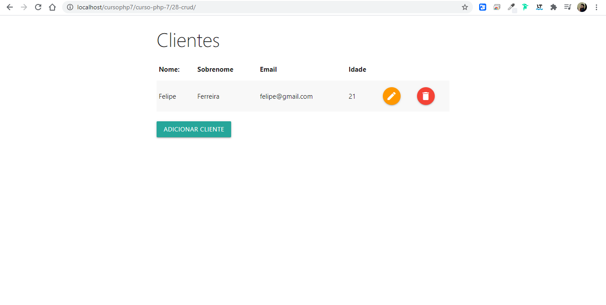

# curso PHP 7

## Curso de introdução a linguagem PHP 7

### No curso foi abordado toda a linguagem PHP básico e no final foi criado um app de cadastro de clientes com o Back-end em PHP procedural com banco de dados mysql. 
### O app possui cadastro de novos clientes, editar e excluir dados já cadastrados.  

